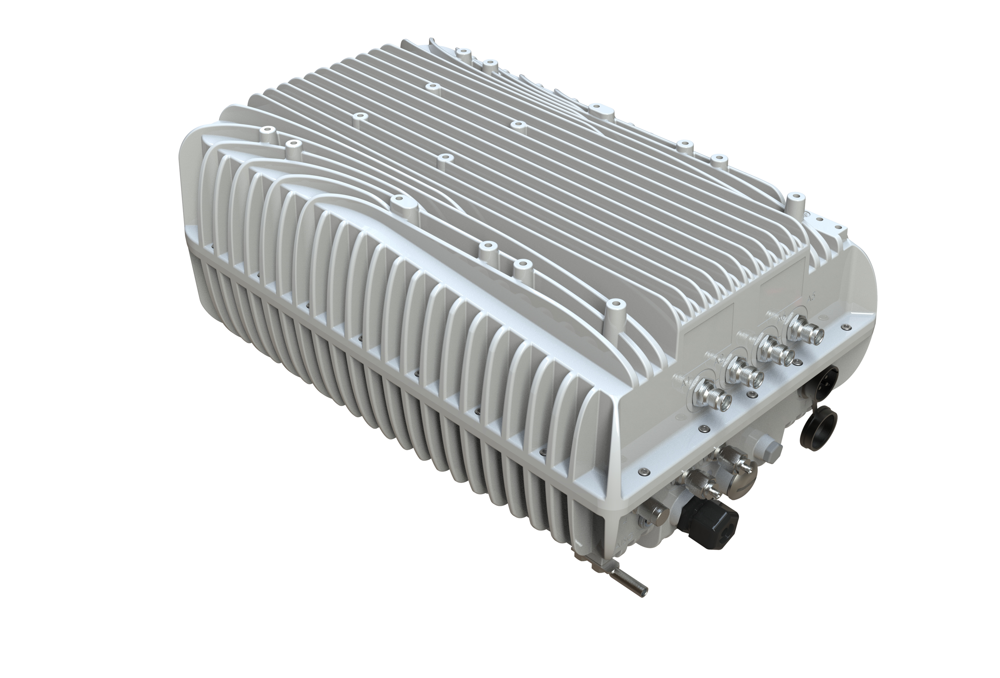

# 有哪些无线电可以购买？

Karrier One提供一系列无线电解决方案，旨在满足各种连接需求。截至2023年8月，我们仅使用来自BLINQ Networks的这些无线电：

## <mark style="color:blue;">**FW-600**</mark> 

* 概述：FW-600在Karrier One产品系列中脱颖而出，是更强大的网络解决方案之一。
* 特点：
  1. 集成：多载波 LTE 基站，提供强大的连接能力。
  2. 适用性：非常适合在较高海拔的偏远地区设置，确保在复杂地形中保持稳定连接。
  3. LTE覆盖范围：提供最广泛的LTE覆盖范围，适用于多种用途。
  4. EPC 内核：先进的核心技术可提高性能。
  5. 功率：最大功率可达 480 瓦。
  6. GPS：配备了GPS接收器。
* 规格
  1. 尺寸：19.4英寸 x 12英寸 x 8.4英寸（长x宽x深）
  2. 重量：43.2磅（19.6公斤）

<figure><figcaption>
FW-600 的 3D 渲染图
</figcaption></figure>

## <mark style="color:red;">**FW-300i**</mark> 

* 概述：FW-300i是一款最先进的无线电，非常适合各种网络需求。
* 特点：
  1. 输出功率：每个60度扇区为32 dBm。
  2. 带宽：信道带宽为10和20兆赫。
  3. LTE合规性：遵守3GPP Release 10。
  4. 用户容量：每个扇区最多可支持96个活跃用户。
  5. 覆盖范围：涵盖完整的CBRS频段（150兆赫兹）。
  6. 速度：每个扇区速度高达 110 Mbps。
  7. 功率：消耗功率为 150 瓦，工作电压为 48 伏直流。
  8. 工作温度：可在 -40°F 至 140°F 温度范围内有效工作。
* 规格：
  1. 尺寸：13.78英寸 x 22.4英寸 x 8.9英寸（长x宽x深）
  2. 重量：26.5 磅（12.0 公斤）

<figure><figcaption>
FW-300i 三维示意图
</figcaption></figure>

## 未来产品

Karrier One 计划将来使用其他无线电。如需了解无线电可用性的最新信息，请使用我们[<mark style="color:red;">网站</mark>](https://karrier.one/)上的 "联系我们 "门户。
