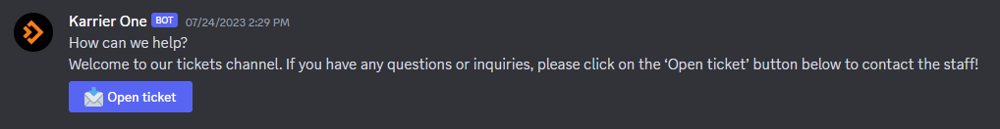

# 如何联系支持人员？

目前，我们的主要沟通渠道是通过本文档 "[<mark style="color:red;">欢迎</mark>](../#lian-xi-ping-tai)"部分中的沟通平台。

我们的主要支持联系平台是Discord。您可以通过我们的“支持工单”频道提交工单。

<figure><figcaption>
Karrier One 机器支持
</figcaption></figure>

您也可以通过我们网站上的 "[<mark style="color:red;">联系我们</mark>](https://karrier.one/) "入口与我们取得联系。
